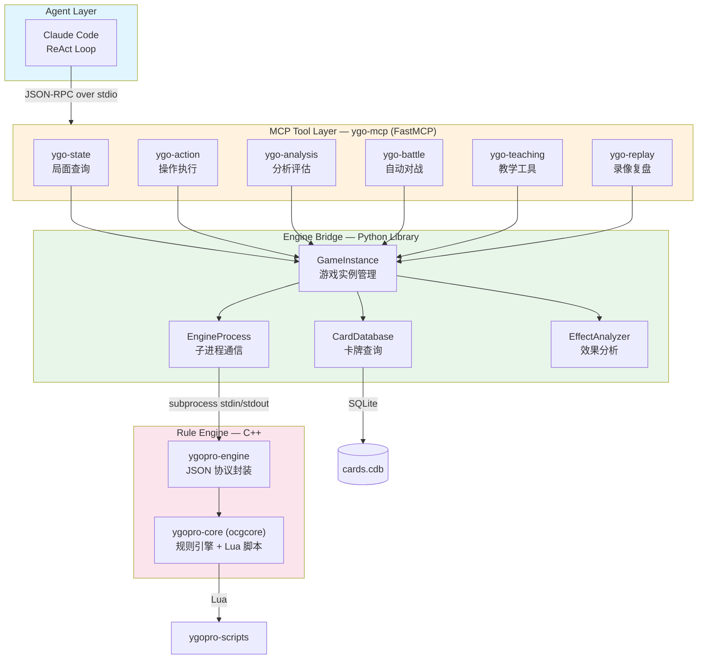

# YGO-AI-Platform

基于 ygopro-core 的 AI 游戏王对战与智能助手，通过 MCP 协议与 Claude Code 集成。让大语言模型能够理解游戏王规则、分析对局局面、执行合法操作，并自主进行策略决策与自动对战。

---

## 特性

- **局面实时查询** — 通过 MCP 工具获取完整游戏快照，包括双方生命值、手牌、场上怪兽/魔法/陷阱、墓地、除外区等全部信息
- **合法操作推荐** — 自动枚举当前回合所有合法操作（召唤、特殊召唤、发动效果、攻击宣言等），帮助 LLM 做出正确决策
- **规则自动判断** — 由 ygopro-core 规则引擎处理所有游戏规则验证，确保每一步操作都符合官方规则
- **AI 辅助决策** — 内置局面评估函数（0-100 评分）与最优路线搜索（Beam Search），支持沙盒模拟推演未来局面
- **自动对战系统** — 支持 AI vs AI 自动对战，可配置不同人格策略（激进型 / 控制型 / 连击型），内置开局库
- **教学与复盘** — 交互式教学工具（卡牌讲解、局面出题、操作解释）与完整录像回放系统（失误分析、改进建议）
- **中英双语卡牌** — 支持中英文卡名查询，集成中文卡牌数据库与效果文本分析
- **可扩展的 MCP 工具生态** — 统一 MCP Server 整合所有工具，新增功能只需添加新的工具模块并注册

---

## 架构概览



**数据流**：Claude Code 作为 Agent 通过 ReAct 循环运行。当需要了解游戏状态时，它通过 MCP 协议调用 `ygo-state` 的工具；需要执行操作时调用 `ygo-action`；需要分析局面时调用 `ygo-analysis`；需要自动对战时调用 `ygo-battle`；教学场景使用 `ygo-teaching`；复盘分析使用 `ygo-replay`。所有工具统一注册在 `ygo-mcp` 服务器中，共享同一个 `GameInstance` 注册表。每个 `GameInstance` 内部通过 `EngineProcess` 与 ygopro-engine C++ 子进程通信，引擎再调用 ygopro-core 规则引擎验证所有操作的合法性。

**核心原则：LLM 负责思考，规则引擎负责验证，MCP 负责连接。**

---

## 技术栈

| 层级 | 技术 | 用途 |
|------|------|------|
| Agent | Claude Code | ReAct 循环、自然语言理解与决策 |
| MCP Protocol | Python MCP SDK (`mcp>=1.0.0`) + FastMCP | 工具注册、JSON-RPC 通信 |
| 数据验证 | Pydantic (`pydantic>=2.0.0`) | 类型安全的数据结构 |
| 规则引擎 | ygopro-core (C++) | 官方游戏王规则实现 |
| 引擎封装 | ygopro-engine (C++) | JSON stdin/stdout 协议桥接 |
| 卡牌脚本 | Lua (ygopro-scripts) | 卡牌效果逻辑（9000+ 脚本） |
| 卡牌数据 | SQLite (cards.cdb) | 卡牌属性数据库（14,000+ 张卡） |
| 效果分析 | 正则表达式引擎 | 卡牌效果文本分类与价值评估 |
| 测试 | pytest + pytest-asyncio | 异步单元测试 |
| 构建 | CMake / Meson / Ninja | C++ 编译 |

---

## 前置条件

- **Python 3.10+**
- **Claude Code** — 已安装并配置
- **C++ 编译器** — Windows: Visual Studio Build Tools (MSVC)；Linux/macOS: GCC/Clang
- **Meson + Ninja** — 用于编译 ygopro-core
- **CMake** — 用于编译 ygopro-engine

---

## 安装

### 1. 克隆仓库

```bash
git clone <your-repo-url> ygo
cd ygo
```

### 2. 编译 ygopro-core（规则引擎）

```bash
# Windows: 使用 x64 Native Tools Command Prompt
cd libs/ygopro-core
meson setup build --default-library=static
ninja -C build
```

> 详细编译指南请参阅 [INSTALL_COMPILER.md](INSTALL_COMPILER.md)

### 3. 编译 ygopro-engine（JSON 协议封装）

```bash
cd libs/ygopro-engine
cmake -B build
cmake --build build
```

编译产物位于 `libs/ygopro-engine/build/ygopro-engine.exe`。

### 4. 准备卡牌数据

```bash
# 卡牌数据库 (SQLite)
# 已包含测试用 cards.cdb，完整版可从 ProjectIgnis/BabelCDB 获取
# 放置于 libs/ygopro-engine/build/cards.cdb

# Lua 脚本
# 已克隆 edo9300/ygopro-scripts 至 libs/ygopro-scripts/

# 中文卡牌数据库 (可选)
# 放置于 libs/ygopro-engine/build/cards_zh.cdb
```

### 5. 安装 Python 依赖

```bash
pip install -e ".[dev]"
```

### 6. 验证安装

```bash
# 运行全部测试
pytest

# 预期输出: 所有测试通过
```

---

## 配置与运行

### MCP Server 注册

项目通过 `.mcp.json` 注册统一的 MCP Server。Claude Code 启动时会自动读取此文件并加载所有工具。

```json
{
  "mcpServers": {
    "ygo": {
      "command": "python",
      "args": ["-m", "ygo_mcp.server"],
      "env": {
        "YGOPRO_ENGINE_PATH": "libs\\ygopro-engine\\build\\ygopro-engine.exe",
        "CARD_DB_PATH": "libs\\ygopro-engine\\build\\cards.cdb"
      }
    }
  }
}
```

> `ygo-mcp` 将 ygo-state、ygo-action、ygo-analysis、ygo-battle 四个模块的工具统一到一个进程中，共享同一个 `GameInstance` 注册表，避免实例隔离问题。

### 环境变量

| 变量 | 说明 | 默认值 |
|------|------|--------|
| `YGOPRO_ENGINE_PATH` | ygopro-engine 可执行文件路径 | 自动检测项目内 `libs/ygopro-engine/build/ygopro-engine.exe` |
| `CARD_DB_PATH` | 卡牌数据库路径 | 自动检测项目内 `libs/ygopro-engine/build/cards.cdb` |

### 启动方式

直接在项目根目录启动 Claude Code，MCP Server 会按需自动启动：

```bash
claude
```

---

## 使用指南

### 示例：让 Claude Code 玩游戏王

在 Claude Code 中，你可以用自然语言与 AI 对话：

**创建对局并查询局面：**

```
> 帮我创建一局游戏王对局，用默认卡组

Claude: 我来帮你创建对局。
[调用 start_battle 工具]
对局已创建，game_id: a1b2c3d4

> 查看当前局面

Claude: [调用 get_game_state 工具]
当前局面：
- 回合: 第1回合，玩家1的主要阶段1
- 玩家1: LP 8000, 手牌5张, 场上空
- 玩家2: LP 8000, 手牌5张 (隐藏)
```

**分析局面并执行操作：**

```
> 我有哪些合法操作？哪个最优？

Claude: [调用 get_legal_moves 工具]
当前有3个可用操作：
1. 通常召唤 "暗黑骑士 盖亚" (ATK 2300)
2. 覆盖一张陷阱卡
3. 结束回合

[调用 evaluate_position 工具]
局面评估: 50/100 (均势)

[调用 find_best_line 工具]
最优路线：召唤怪兽 → 覆盖陷阱 → 结束回合

> 执行最优操作

Claude: [调用 execute_move 工具]
操作执行成功。场上已召唤 "暗黑骑士 盖亚"。
```

**教学与复盘：**

```
> 讲解一下"灰流丽"这张卡

Claude: [调用 explain_card 工具, card_name="灰流丽"]
灰流丽 (效果怪兽)
- ATK 0 / DEF 1800
- 效果: 对手发动包含"从卡组把卡加入手牌"的效果时，
        可以丢弃此卡无效那个发动
- 关键词: negate (无效), hand_trap (手坑)
- 战略价值: 最强手坑之一，打断对手展开的关键
```

---

## MCP 工具一览

### 局面查询 (ygo-state)

| 工具 | 说明 |
|------|------|
| `get_game_state` | 获取完整游戏快照（生命值、手牌、场上、墓地等） |
| `get_legal_moves` | 列出当前所有合法操作 |
| `get_zone_detail` | 查询指定区域的详细信息 |
| `get_card_info` | 查询卡牌属性（攻击力、效果、种族等） |

### 操作执行 (ygo-action)

| 工具 | 说明 |
|------|------|
| `execute_move` | 执行一个游戏操作（召唤、发动效果等） |
| `respond_chain` | 连锁响应（对应对手的效果发动） |
| `declare_attack` | 攻击宣言（选择攻击怪兽与攻击目标） |

### 分析评估 (ygo-analysis)

| 工具 | 说明 |
|------|------|
| `simulate_move` | 沙盒模拟：在不修改实际状态的情况下推演操作结果 |
| `evaluate_position` | 局面评分（0-100），评估当前优劣势 |
| `find_best_line` | 最优路线搜索，寻找未来 N 步的最佳操作序列 |
| `explain_line` | 解释一个操作序列的意图和效果 |

### 自动对战 (ygo-battle)

| 工具 | 说明 |
|------|------|
| `start_battle` | 创建新的对局 |
| `ai_decide` | AI 策略决策（根据局面选择最优操作） |
| `auto_play` | 自动对战（AI vs AI 运行完整对局） |
| `get_battle_log` | 获取对战日志与历史记录 |

### 教学工具 (ygo-teaching)

| 工具 | 说明 |
|------|------|
| `explain_card` | 详细讲解卡牌效果和用法（支持中英文卡名） |
| `explain_move` | 解释某个操作的意图和效果 |
| `quiz_position` | 基于当前局面出题（最优操作选择、威胁识别等） |
| `check_answer` | 检查答案并解释 |

### 录像复盘 (ygo-replay)

| 工具 | 说明 |
|------|------|
| `save_replay` | 保存对局录像 |
| `load_replay` | 加载对局录像 |
| `get_turn_state` | 获取指定回合的游戏状态 |
| `analyze_mistakes` | 分析对局中的关键失误 |
| `suggest_improvement` | 为指定回合提供改进建议 |

---

## 开发路线图

### Phase 0: 调研与设计 ✅

- ygopro-core API 分析与集成方案确定
- 项目架构设计（四层 MCP 插件架构）

### Phase 1: 基础框架 ✅

- 项目目录结构搭建
- pyproject.toml 配置（根项目 + 子包）
- MCP Server 注册表 `.mcp.json`

### Phase 2: C++ 引擎封装 ✅

- ygopro-core 编译（静态库 libocgcore.a）
- ygopro-engine JSON 协议封装（stdin/stdout）
- 引擎启动与基本通信验证

### Phase 3: Python 引擎桥接 ✅

- EngineProcess 子进程管理（含超时机制）
- GameInstance 游戏实例注册表
- CardDatabase 卡牌数据库查询（中英双语）
- 完整的类型系统（Phase, CardType, Zone, MoveType 等）

### Phase 4: ygo-state 局面查询 ✅

- 完整局面快照工具（LLM 友好格式）
- 合法操作枚举工具（自动处理引擎提示）
- 区域详情与卡牌信息查询

### Phase 5: ygo-action 操作执行 ✅

- 操作执行工具
- 连锁响应工具
- 攻击宣言工具
- 自动提示处理（select_place, select_card 等）

### Phase 6: ygo-analysis 分析评估 ✅

- 沙盒模拟推演（实例克隆 + 操作回放）
- 局面评分函数（多维度加权评估）
- 最优路线搜索（Beam Search）
- 操作序列解释

### Phase 7: ygo-battle 自动对战 ✅

- 对局创建与管理
- AI 决策引擎（支持多种人格策略）
- 自动对战与日志记录
- 开局库（Opening Book）

### Phase 8: 统一 MCP Server ✅

- ygo-mcp 统一服务器（整合所有工具到单进程）
- FastMCP 框架迁移
- Prompt 模板系统（分析 / 对战 / 教学）

### Phase 9: 教学与复盘系统 ✅

- 卡牌效果分析引擎（关键词分类 + 价值评估）
- 中文卡牌名称解析
- 交互式教学工具（出题 / 讲解 / 答题）
- 录像回放系统（保存 / 加载 / 回放）
- 失误分析与改进建议

### 进行中 / 未来计划

- **P2**: 完善 C++ Wrapper（get_legal_moves / do_move 完整实现）
- **P3**: MCP Server 端到端集成测试（连接真实引擎）
- **P4**: AI 策略优化（深度推演、LLM 集成决策、更多 Agent 人格）
- **P5**: 卡组构筑工具（自动组卡、卡组分析）
- **P6**: 在线对战支持（网络通信、多房间管理）

---

## 项目结构

```
ygo/
├── .mcp.json                              # MCP Server 注册表
├── CLAUDE.md                              # Claude Code 项目说明
├── README.md                              # 本文件
├── pyproject.toml                         # 根项目配置 (依赖: mcp, pydantic)
│
├── libs/
│   ├── ygopro-core/                       # edo9300/ygopro-core 规则引擎源码
│   ├── ygopro-engine/                     # C++ JSON 协议封装
│   │   ├── src/                           #   bridge.cpp, protocol.cpp, main.cpp
│   │   └── build/                         #   编译产物 (ygopro-engine.exe, cards.cdb)
│   └── ygopro-scripts/                    # Lua 卡牌效果脚本 (9000+)
│
├── packages/
│   ├── ygo-engine-bridge/                 # Python 引擎桥接库
│   │   └── src/ygo_engine_bridge/
│   │       ├── types.py                   #   类型定义 (Phase, CardType, Zone...)
│   │       ├── state.py                   #   状态数据结构 (GameState, Card, Move)
│   │       ├── process.py                 #   子进程管理 (EngineProcess)
│   │       ├── instance.py                #   游戏实例注册表 (GameInstance)
│   │       ├── cards.py                   #   卡牌数据库查询 (CardDatabase)
│   │       ├── effects.py                 #   卡牌效果分析 (分类/价值/优先级)
│   │       └── card_names_zh.py           #   中文卡名解析
│   │
│   ├── ygo-state/                         # 局面查询 MCP 工具
│   │   └── src/ygo_state/tools/
│   │       ├── get_game_state.py          #   完整局面快照
│   │       ├── get_legal_moves.py         #   合法操作列表
│   │       ├── get_zone_detail.py         #   区域详情
│   │       └── get_card_info.py           #   卡牌信息查询
│   │
│   ├── ygo-action/                        # 操作执行 MCP 工具
│   │   └── src/ygo_action/tools/
│   │       ├── execute_move.py            #   执行操作
│   │       ├── respond_chain.py           #   连锁响应
│   │       └── declare_attack.py          #   攻击宣言
│   │
│   ├── ygo-analysis/                      # 分析评估 MCP 工具
│   │   └── src/ygo_analysis/tools/
│   │       ├── simulate_move.py           #   沙盒模拟
│   │       ├── evaluate_position.py       #   局面评分
│   │       ├── find_best_line.py          #   最优路线搜索
│   │       └── explain_line.py            #   操作序列解释
│   │
│   ├── ygo-battle/                        # 自动对战 MCP 工具
│   │   └── src/ygo_battle/
│   │       ├── tools/
│   │       │   ├── start_battle.py        #   创建对局
│   │       │   ├── ai_decide.py           #   AI 决策
│   │       │   ├── auto_play.py           #   自动对战
│   │       │   └── get_battle_log.py      #   对战日志
│   │       ├── decks.py                   #   预设卡组构筑
│   │       └── opening_book.py            #   开局库
│   │
│   └── ygo-mcp/                           # 统一 MCP Server
│       └── src/ygo_mcp/
│           ├── server.py                  #   FastMCP 入口 (注册所有工具)
│           ├── prompts.py                 #   Prompt 模板 (分析/对战/教学)
│           └── tools/
│               ├── teaching.py            #   教学工具 (explain_card, quiz...)
│               └── replay.py              #   录像工具 (save_replay, analyze...)
│
├── data/
│   └── replays/                           # 对局录像存储
│
└── tests/                                 # 集成测试
    ├── test_phase6.py
    ├── test_phase7.py
    ├── test_phase8.py
    └── test_phase9.py
```

---

## 贡献指南

### 添加新的 MCP 工具

1. 在对应包的 `tools/` 目录下创建新的工具文件
2. 实现工具函数（async 函数，参数和返回值使用类型注解）
3. 在 `packages/ygo-mcp/src/ygo_mcp/server.py` 中注册工具：`mcp.tool()(your_tool)`
4. 编写测试文件
5. 更新 `pyproject.toml` 如需新增依赖

### 添加新的 MCP Server 模块

1. 在 `packages/` 下创建新目录，参照现有包结构
2. 创建 `pyproject.toml`、`src/`、`tests/` 目录
3. 在 `ygo-mcp` 的 `pyproject.toml` 中添加依赖
4. 在 `ygo-mcp/server.py` 中导入并注册新工具

### 运行测试

```bash
# 运行全部测试
pytest

# 运行特定模块测试
pytest packages/ygo-state/tests/

# 运行单个测试文件
pytest packages/ygo-state/tests/test_state_tools.py -v

# 运行集成测试
pytest tests/
```

### 代码规范

- Python 代码使用 type hints
- MCP 工具函数需有清晰的 docstring（描述参数和返回值）
- 测试覆盖所有新增的 MCP 工具
- 异步工具使用 `async def`

---

## 许可证

本项目采用 [MIT License](LICENSE) 开源许可证。

ygopro-core 遵循其原始许可证 (AGPL-3.0)。使用本项目时请同时遵守 ygopro-core 的许可条款。
